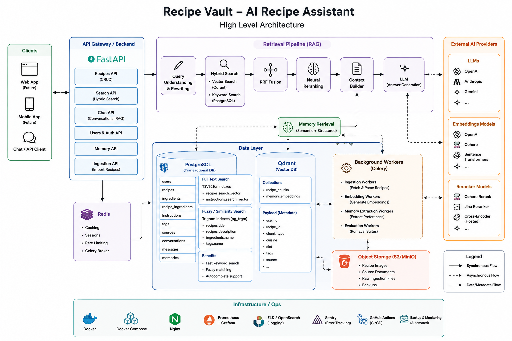

# Recipe Vault

> RAG-powered AI cookbook — search, discover, and chat with your recipes using hybrid semantic search and Claude.


---

## Overview

Recipe Vault is a personal AI recipe assistant built on a **Retrieval-Augmented Generation (RAG)** architecture. It combines structured recipe management with a conversational AI layer — letting users search, discover, and interact with their cookbook through natural language.

Recipes are stored relationally in PostgreSQL and indexed as dense vectors in Qdrant. At query time, a hybrid search pipeline fuses keyword and semantic signals, re-ranks results with a neural reranker, and passes context to Claude for grounded, personalized responses.

---

## Architecture



### How it works

**Recipe Ingestion**
When a recipe is saved, a Celery worker picks it up asynchronously. The recipe is chunked into structured text (title, cuisine, ingredients, steps, notes, tags), embedded with Voyage AI, and upserted into Qdrant. A lightweight marker row in PostgreSQL tracks embedding state.

**Hybrid Search**
Queries are rewritten and expanded by Claude (cheap model, fast). Two retrieval arms run in parallel:
- **Keyword arm** — PostgreSQL `tsvector` full-text search + pg_trgm trigram matching on ingredients
- **Semantic arm** — dense vector search in Qdrant, filtered by `owner_id`

Results are fused with Reciprocal Rank Fusion (RRF), then re-ranked by Cohere or a local cross-encoder.

**Chat Agent**
Claude runs a tool-use loop with three tools: `search_recipes`, `get_recipe`, and `update_memory`. User preferences learned from conversation are stored in PostgreSQL and injected into every system prompt, enabling personalized responses across sessions.

---

## Tech Stack

| Layer | Technology |
|---|---|
| API | FastAPI (sync), Uvicorn |
| Database | PostgreSQL 16, SQLAlchemy 2.0, Alembic |
| Vector Store | Qdrant |
| Embeddings | Voyage AI (`voyage-3`, 1024-dim) |
| LLM | Anthropic Claude |
| Reranker | Cohere / cross-encoder (pluggable) |
| Task Queue | Celery + Redis |
| Auth | JWT (python-jose) + bcrypt |
| Validation | Pydantic v2 |
| Storage | S3-compatible (images) |
| Infra | Docker, Nginx, GitHub Actions |

---

## Features

- **Recipe CRUD** — full recipe management with steps, ingredients, tags, sources, nutrition, images, and cook logs
- **Best-effort creation** — only a title is required; nested sections (steps, ingredients, etc.) fail gracefully with warnings
- **Canonical ingredient dictionary** — fuzzy ingredient matching via pg_trgm deduplicates canonical ingredients across recipes
- **Hybrid semantic search** — keyword + vector search fused with RRF for high-recall retrieval
- **Conversational AI** — Claude agent with tool use, grounded on your personal recipe collection
- **Persistent user memory** — preferences and dietary restrictions learned from chat and injected into future sessions
- **Async ingestion** — non-blocking embedding pipeline via Celery workers
- **Versioned API** — `/api/v1/` with auth enforced at the router level

---

## Getting Started

### Prerequisites

- Docker & Docker Compose
- Python 3.13+ with [uv](https://github.com/astral-sh/uv)
- API keys: Anthropic, Voyage AI, Cohere (or use local cross-encoder)

### 1. Clone and configure

```bash
git clone https://github.com/ssathyanaray2/Recipe-Vault.git
cd Recipe-Vault/backend
cp .env.example .env
# Fill in your API keys in .env
```

### 2. Start infrastructure

```bash
docker-compose up -d   # Postgres + Redis + Qdrant
```

### 3. Install dependencies and run migrations

```bash
uv sync
uv run alembic upgrade head
```

### 4. Start the API

```bash
uv run uvicorn app.main:app --reload
```

### 5. Start the Celery worker

```bash
uv run celery -A app.worker worker --loglevel=info
```

API docs available at `http://localhost:8000/docs`

---

## Environment Variables

| Variable | Description |
|---|---|
| `DATABASE_URL` | PostgreSQL connection string |
| `JWT_SECRET_KEY` | Secret for signing JWT tokens |
| `ANTHROPIC_API_KEY` | Claude API key |
| `VOYAGE_API_KEY` | Voyage AI embeddings key |
| `EMBEDDING_MODEL` | Voyage model name (default: `voyage-3`) |
| `COHERE_API_KEY` | Cohere reranker key |
| `RERANKER_PROVIDER` | `cohere` or `cross_encoder` |
| `QDRANT_URL` | Qdrant instance URL |
| `QDRANT_API_KEY` | Qdrant API key (cloud) |
| `QDRANT_COLLECTION_NAME` | Collection name (default: `recipes`) |
| `CELERY_BROKER_URL` | Redis URL for Celery |
| `CELERY_RESULT_BACKEND` | Redis URL for task results |

---

## API Reference

All endpoints are under `/api/v1/`. Authentication uses Bearer JWT tokens.

### Auth
| Method | Endpoint | Description |
|---|---|---|
| `POST` | `/auth/register` | Register a new user |
| `POST` | `/auth/login` | Login and receive JWT |
| `GET` | `/auth/me` | Get current user |

### Recipes
| Method | Endpoint | Description |
|---|---|---|
| `POST` | `/recipes` | Create recipe (best-effort) |
| `GET` | `/recipes` | List recipes (paginated) |
| `GET` | `/recipes/{id}` | Get full recipe detail |
| `PATCH` | `/recipes/{id}` | Update core fields |
| `DELETE` | `/recipes/{id}` | Delete recipe |
| `POST` | `/recipes/{id}/favorite` | Toggle favorite |

Sub-resources follow the same pattern under `/{id}/steps`, `/{id}/ingredients`, `/{id}/tags`, `/{id}/sources`, `/{id}/images`, `/{id}/nutrition`, `/{id}/cook-logs`.

### Search & Chat *(coming soon)*
| Method | Endpoint | Description |
|---|---|---|
| `POST` | `/search` | Hybrid semantic search |
| `POST` | `/chat/sessions` | Start a chat session |
| `POST` | `/chat/sessions/{id}/messages` | Send a message |

---

## Project Structure

```
backend/
├── app/
│   ├── api/
│   │   ├── router.py          # Top-level API router (/api)
│   │   ├── deps.py            # Auth dependency (get_current_user)
│   │   └── v1/
│   │       ├── router.py      # v1 router — auth enforced here
│   │       ├── users.py
│   │       ├── recipes.py
│   │       ├── search.py
│   │       └── chat.py
│   ├── core/
│   │   ├── config.py          # Settings via pydantic-settings
│   │   ├── exceptions.py      # Domain exceptions (no FastAPI imports)
│   │   ├── error_handlers.py  # Global exception → HTTP response
│   │   └── security.py        # JWT + bcrypt
│   ├── models/                # SQLAlchemy 2.0 models
│   ├── schemas/               # Pydantic v2 schemas
│   ├── recipes/               # Repository + service
│   ├── users/                 # Repository + service
│   ├── ingestion/             # Chunking + embedding pipeline
│   ├── retrieval/             # Hybrid search + reranking + context
│   ├── chat/                  # Claude agent + tool definitions
│   ├── memory/                # User preference extraction + retrieval
│   ├── providers/             # Pluggable: embeddings, LLM, rerankers
│   └── vectorstore/           # Qdrant implementation
├── alembic/                   # Migrations
├── tests/
│   ├── unit/                  # No DB required
│   ├── integration/           # Requires test DB
│   └── eval/                  # Recall@k / MRR evaluation
└── docker-compose.yml
```

---

## Testing

```bash
# Unit tests (no DB or external services)
uv run python -m pytest tests/unit/

# Integration tests (requires running test DB)
uv run python -m pytest tests/integration/

# RAG evaluation — recall@k and MRR against golden query set
uv run python tests/eval/run_eval.py
```

---

## Roadmap

- [x] Recipe CRUD with best-effort creation
- [x] JWT authentication
- [x] Hybrid search pipeline (keyword + semantic)
- [x] Async ingestion via Celery
- [x] Recipe chunker
- [ ] Embedding providers (Voyage, OpenAI, HuggingFace)
- [ ] Claude chat agent with tool use
- [ ] User memory extraction and injection
- [ ] Search API
- [ ] iOS / Android client
- [ ] Image upload with S3 pre-signed URLs
- [ ] Recipe import from URL

---

## License

MIT
